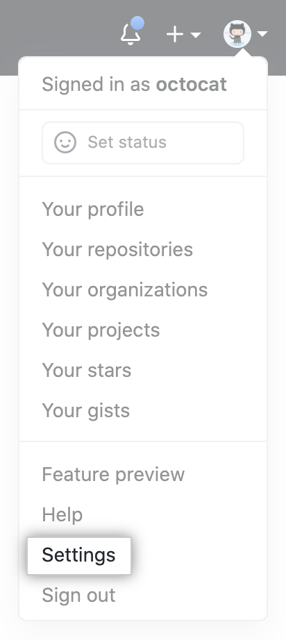
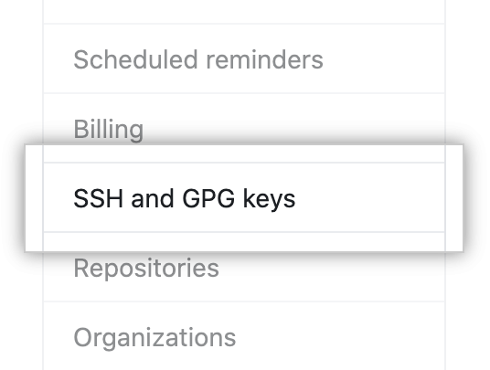
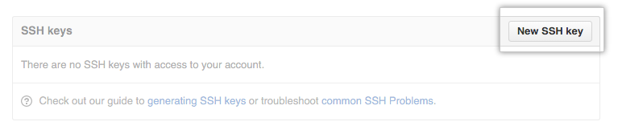
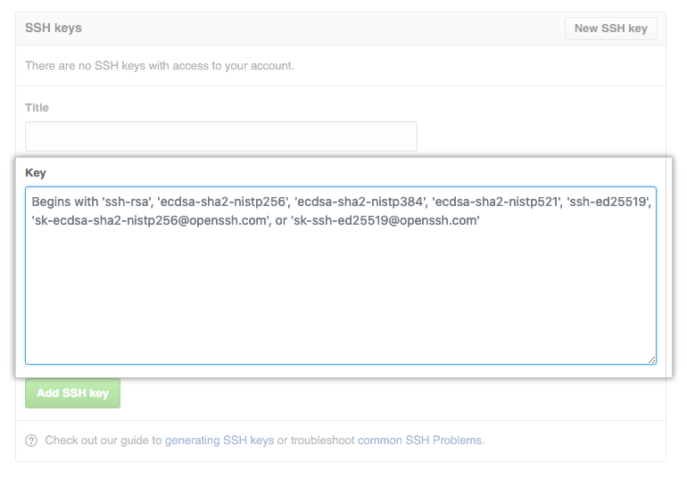
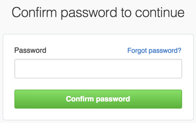
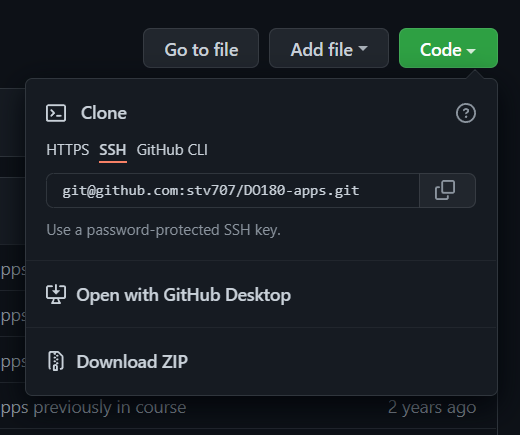
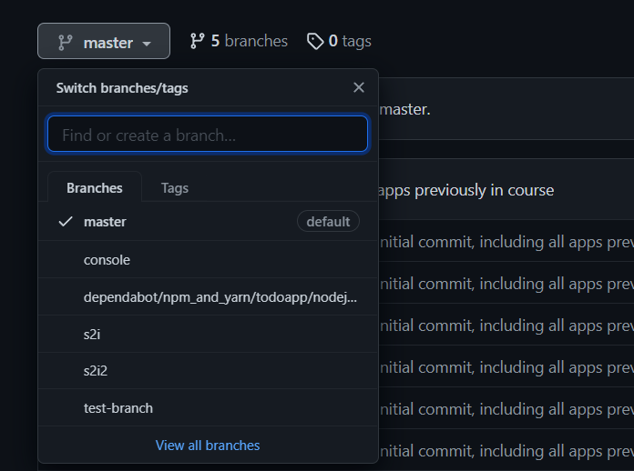

# ssh_access_git
 - Step by Step to use ssh key based access to private/public repo in Git with RW access
 - This is to setup a Linux machine (a.k.a: developer Machine) to access Git Repo with SSH 
 - DO NOT perform this on public computer, if using public computer ( training, testing) use Generate Token, as GitHub Stop accepting Password Authentication Since Oct 2021

### Step 1
- In your linux terminal, generate ssh key-pair
- Make sure the keyfile name and passphrase is set!
  <pre>
  [student@infra ~]$ ssh-keygen
  Generating public/private rsa key pair.
  Enter file in which to save the key (/home/student/.ssh/id_rsa): <b>/home/student/.ssh/stv707_rsa</b>
  Created directory /home/student/.ssh.
  Enter passphrase (empty for no passphrase): <b>'YOUR PASSPHRASE'</b>
  Enter same passphrase again: <b>'YOUR PASSPHRASE'</b>
  Your identification has been saved in /home/student/.ssh/stv707_rsa.
  Your public key has been saved in /home/student/.ssh/stv707_rsa.pub.
  The key fingerprint is:
  SHA256:XXXXXX7Qy2vwzLjCUA1QHb7dARdIGXXXXXX student@infra.ocp4.cognitoz.org
  The keys randomart image is:
  +---[RSA 3072]----+
  |...o.*Bo         |
  |.   *o.+         |
  | . .+=*..        |
  |  +=.@oo.+       |
  | .o.@ =.S .      |
  | .o. *   . o     | 
  |  .o  +   o o    |
  | .  .. o   +     |
  | E.  ..   .      |
  +----[SHA256]-----+

### Step 2 
- Create ssh **config** file with ssh over https setting using the key created above
   <pre>
   [student@infra ~]$ cat ~/.ssh/config

      Host github.com
          IdentityFile ~/.ssh/stv707_rsa
          Hostname ssh.github.com
          Port 443
          User git
   

### Step 3 
- Run ssh agent and add private key passphrase
   <pre>
   [student@infra ~]$ eval $(ssh-agent)
   Agent pid 5136
    
   [student@infra ~]$ ssh-add .ssh/stv707_rsa
   Enter passphrase for .ssh/stv707_rsa:  <b>'YOUR PASSPHRASE'</b>
   Identity added: .ssh/stv707_rsa (student@infra.ocp4.cognitoz.org) 

### Step 4
- Add Public key to github
- Copy the public key 
  <pre>
   [student@infra ~]$ cat ~/.ssh/stv707_rsa.pub
   # Then select and copy the contents of the stv707_rsa.pub file
   # displayed in the terminal to your clipboard

  
- In the upper-right corner of github page, click your profile photo, then click Settings.
  

    
  

  
- In the user settings sidebar, click SSH and GPG keys.
  <br>
    

- Click New SSH key or Add SSH key. 
  <br> 
    


- Paste your key into the "Key" field.
  <br>
    


- Click Add SSH key.
  <br>
    


- If prompted, confirm your GitHub password.
  <br>
    


### Step 5 
- Test your connection to github via ssh 
  <pre> 
  [student@infra ~]$ ssh -T git@github.com 
  
  The authenticity of host '[ssh.github.com]:443 ([20.205.243.160]:443)' can't be established.
  RSA key fingerprint is SHA256:nThbg6kXUpJWGl7E1IGOCspRomTxdCARLviKw6E5SY8.
  Are you sure you want to continue connecting (yes/no/[fingerprint])? yes
  

  Hi stv707! You've successfully authenticated, but GitHub does not provide shell access.
  ```

### Step 6
- Clone a repo using ssh 
- get the ssh clone url as per below image
  <br>

    

- use git clone to get the repo 
- add new branch and push 
  <pre>
  [student@infra ~]$ git clone git@github.com:stv707/DO180-apps.git

  [student@infra ~]$ cd DO180-apps/

  [student@infra DO180-apps]$ git checkout master

  [student@infra DO180-apps]$ git checkout -b test-branch

  [student@infra DO180-apps]$ git push -u origin  test-branch

### Step 7 
- Verify the new branch is pushed to github

  


# END

 >> Note: **ssh-agent pid will be killed once you exit the terminal, you need to automate ssh agent via .profile, so everytime you login to terminal, you need to add your private key to ssh-agent** 

 >> Note: Refer: https://unix.stackexchange.com/questions/90853/how-can-i-run-ssh-add-automatically-without-a-password-prompt

</pre>